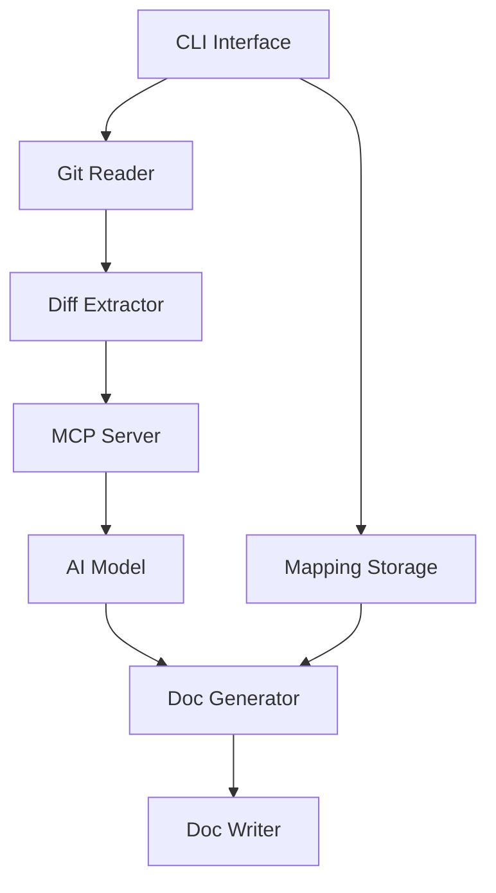

# ktme - Knowledge Transfer Me

A Rust-based CLI tool that automates documentation generation from code changes using AI models through the Model Context Protocol (MCP).

## Overview

ktme (Knowledge Transfer Me) helps development teams keep documentation synchronized with code changes by:

- Extracting code changes from commits, staged files, and pull requests
- Processing changes through AI models via MCP server
- Generating or updating documentation in Markdown or Confluence
- Maintaining mappings between services and their documentation

## Features

- **Multi-Source Change Extraction**: Extract from commits, staged changes, pull requests, or commit ranges
- **AI-Powered Documentation**: Generate intelligent documentation using MCP-connected AI models
- **Multi-Format Output**: Support for local Markdown files and Confluence pages
- **Service Mapping**: Local storage system for service-to-documentation mappings
- **Git Platform Integration**: Support for GitHub, GitLab, and Bitbucket
- **Flexible Configuration**: TOML-based configuration with environment variable support

## Installation

### Prerequisites

- Rust 1.70 or higher
- Git 2.30 or higher
- Access to an AI model API (Claude, GPT, etc.)
- (Optional) Confluence instance for Confluence integration

### Build from Source

```bash
git clone https://github.com/FreePeak/ktme.git
cd ktme
cargo build --release
```

### Install

```bash
cargo install --path .
```

Or install directly from crates.io (once published):

```bash
cargo install ktme
```

### Verify Installation

```bash
ktme --version
```

## Quick Start

### 1. Initialize Configuration

```bash
ktme config init
```

This creates a configuration file at `~/.config/ktme/config.toml`.

### 2. Configure AI Model

Edit the configuration file to add your AI model settings:

```toml
[mcp]
model = "claude-3-5-sonnet-20241022"
max_tokens = 4096
```

Set your API key:

```bash
export KTME_MCP_API_KEY="your-api-key"
```

### 3. Set Up Service Mapping

Map your services to their documentation:

```bash
# Map to local markdown file
ktme mapping add my-service --file ~/projects/my-company/my-service/README.md

# Map to Confluence page
ktme mapping add my-service --url https://confluence.example.com/display/DEV/MyService
```

### 4. Generate Documentation

Generate documentation from a commit:

```bash
cd ~/projects/my-service
ktme generate --commit HEAD --service my-service
```

That's it! Your documentation is now updated based on the latest commit.

## Usage

### Extract Code Changes

Extract changes from various sources:

```bash
# From a specific commit
ktme extract --commit abc123

# From staged changes
ktme extract --staged

# From a commit range
ktme extract --commit v1.0.0..v1.1.0

# From a pull request
ktme extract --pr 123 --provider github

# Save to a specific file
ktme extract --commit abc123 --output /tmp/changes.json
```

### Generate Documentation

Generate new documentation from code changes:

```bash
# From a commit
ktme generate --commit abc123 --service my-service

# From extracted changes file
ktme generate --input changes.json --service my-service

# Specify documentation type
ktme generate --commit abc123 --service my-service --type api-doc

# Output to Confluence
ktme generate --commit abc123 --service my-service --format confluence
```

### Update Existing Documentation

Update documentation without replacing it entirely:

```bash
# Update from commit
ktme update --commit abc123 --service my-service

# Update specific section
ktme update --commit abc123 --service my-service --section "API Changes"

# Preview changes before applying
ktme update --commit abc123 --service my-service --dry-run
```

### Manage Service Mappings

```bash
# Add a mapping
ktme mapping add my-service --file ~/docs/my-service/README.md
ktme mapping add my-service --url https://confluence.example.com/page/123

# List all mappings
ktme mapping list

# Get mapping for a specific service
ktme mapping get my-service

# Remove a mapping
ktme mapping remove my-service

# Auto-discover services in a directory
ktme mapping discover --directory ~/projects/my-company/
```

### MCP Server Management

```bash
# Start MCP server
ktme mcp start

# Check server status
ktme mcp status

# Stop server
ktme mcp stop
```

### Configuration Management

```bash
# Show current configuration
ktme config show

# Set configuration values
ktme config set confluence.base_url "https://example.atlassian.net"
ktme config set mcp.model "claude-3-5-sonnet-20241022"

# Validate configuration
ktme config validate
```

## Configuration

### Configuration File

Location: `~/.config/ktme/config.toml`

```toml
[general]
default_directory = "~/work/my-company"
temp_directory = "/tmp/ktme"
log_level = "info"

[git]
default_branch = "main"
include_merge_commits = false
max_commit_range = 100

[mcp]
server_binary = "~/.cargo/bin/ktme-mcp-server"
model = "claude-3-5-sonnet-20241022"
max_tokens = 4096
temperature = 0.7

[documentation]
default_format = "markdown"
template_directory = "~/.config/ktme/templates"
include_metadata = true

[confluence]
base_url = "https://your-domain.atlassian.net"
auth_type = "token"
api_token = "${CONFLUENCE_API_TOKEN}"
space_key = "DEV"

[storage]
mappings_file = "~/.config/ktme/mappings.toml"
auto_discover = false
```

### Environment Variables

```bash
# AI Model Configuration
export KTME_MCP_API_KEY="your-api-key"
export KTME_MCP_MODEL="claude-3-5-sonnet-20241022"

# Confluence Authentication
export CONFLUENCE_API_TOKEN="your-confluence-token"
export CONFLUENCE_USERNAME="your-email@example.com"

# General Settings
export KTME_CONFIG="~/.config/ktme/config.toml"
export KTME_LOG_LEVEL="debug"
```

## Examples

### Example 1: Document a New Feature

You've just completed a feature in a feature branch:

```bash
# Extract changes from your feature branch
ktme extract --commit main..feature/new-api --output /tmp/feature.json

# Generate documentation
ktme generate --input /tmp/feature.json --service api-gateway --type api-doc

# Review the generated documentation
cat ~/projects/api-gateway/API.md

# Commit the documentation
git add ~/projects/api-gateway/API.md
git commit -m "docs: Update API documentation for new endpoints"
```

### Example 2: Update Documentation from PR

A pull request is about to be merged:

```bash
# Extract PR changes
ktme extract --pr 456 --provider github

# Update the changelog
ktme update --pr 456 --service user-service --section "Changelog"

# Review changes
git diff ~/projects/user-service/CHANGELOG.md

# Commit if satisfied
git add ~/projects/user-service/CHANGELOG.md
git commit -m "docs: Update changelog for PR #456"
```

### Example 3: Bulk Documentation Update

Generate documentation for an entire release:

```bash
# Generate docs for all commits in the release
ktme generate --commit v2.0.0..v2.1.0 --service payment-service

# AI processes all commits and creates comprehensive documentation
# Output saved to mapped location for payment-service

# Review and commit
git add ~/projects/payment-service/
git commit -m "docs: Update documentation for v2.1.0 release"
```

### Example 4: Confluence Integration

Publish documentation to Confluence:

```bash
# Configure Confluence
export CONFLUENCE_API_TOKEN="your-token"
ktme config set confluence.base_url "https://company.atlassian.net"
ktme config set confluence.space_key "DEV"

# Map service to Confluence page
ktme mapping add auth-service --url "https://company.atlassian.net/wiki/spaces/DEV/pages/12345"

# Generate and publish
ktme generate --commit abc123 --service auth-service --format confluence

# Documentation is automatically published to the mapped Confluence page
```

### Example 5: Staged Changes Documentation

Document changes before committing:

```bash
# Make changes to your code
vim src/main.rs

# Stage changes
git add src/main.rs

# Generate documentation from staged changes
ktme generate --staged --service my-service

# Review generated documentation
cat ~/projects/my-service/README.md

# Commit both code and documentation
git add ~/projects/my-service/README.md
git commit -m "feat: Add new feature with documentation"
```

## Service Mapping

### Mapping File Format

Location: `~/.config/ktme/mappings.toml`

```toml
[mappings]
version = "1.0"
last_updated = "2025-12-04T00:00:00Z"

[[services]]
name = "api-gateway"
path = "my-company/api-gateway"
docs = [
  { type = "markdown", location = "my-company/api-gateway/README.md" },
  { type = "markdown", location = "my-company/api-gateway/API.md" },
  { type = "confluence", location = "https://confluence.example.com/display/DEV/APIGateway" }
]

[[services]]
name = "user-service"
path = "my-company/user-service"
docs = [
  { type = "markdown", location = "my-company/user-service/README.md" }
]
```

### Directory Structure Example

```
my-company/
├── api-gateway/
│   ├── src/
│   ├── README.md
│   ├── API.md
│   └── ARCHITECTURE.md
├── user-service/
│   ├── src/
│   ├── README.md
│   └── CHANGELOG.md
└── payment-service/
    ├── src/
    └── README.md
```

## MCP Server

### Overview

ktme includes an MCP server that provides tools for AI models to:

- Read extracted code changes
- Query service-document mappings
- Generate documentation based on changes
- Update existing documentation intelligently

### MCP Tools

The server exposes the following tools:

1. **read_changes**: Read extracted diff file
2. **get_service_mapping**: Retrieve document URL for a service
3. **list_services**: List all mapped services
4. **generate_documentation**: Create new documentation from changes
5. **update_documentation**: Modify existing documentation

### Starting the Server

```bash
# Start with default configuration
ktme mcp start

# Start with custom configuration
ktme mcp start --config custom-mcp.toml

# Start in background
ktme mcp start --daemon
```

## Confluence Integration

### Setup

1. Generate an API token from Confluence:
   - Go to https://id.atlassian.com/manage-profile/security/api-tokens
   - Create new token
   - Save it securely

2. Configure ktme:

```bash
export CONFLUENCE_API_TOKEN="your-token-here"
ktme config set confluence.base_url "https://your-domain.atlassian.net"
ktme config set confluence.space_key "YOUR_SPACE"
ktme config set confluence.auth_type "token"
```

3. Map services to Confluence pages:

```bash
ktme mapping add my-service --url "https://your-domain.atlassian.net/wiki/spaces/DEV/pages/123456"
```

### Authentication Methods

#### API Token (Recommended)

```bash
export CONFLUENCE_API_TOKEN="your-api-token"
export CONFLUENCE_USERNAME="your-email@example.com"
```

#### Basic Authentication

```toml
[confluence]
auth_type = "basic"
username = "${CONFLUENCE_USERNAME}"
password = "${CONFLUENCE_PASSWORD}"
```

## Templates

### Custom Templates

Create custom documentation templates in `~/.config/ktme/templates/`:

#### API Documentation Template (`api-doc.md`)

```markdown
# {{service_name}} API Documentation

## Overview
{{overview}}

## Recent Changes
{{changes_summary}}

## Endpoints
{{endpoints}}

## Authentication
{{authentication}}

## Examples
{{examples}}

---
*Last updated: {{timestamp}}*
*Generated from commit: {{commit_hash}}*
```

#### Changelog Template (`changelog.md`)

```markdown
# Changelog

## [{{version}}] - {{date}}

### Added
{{added_features}}

### Changed
{{changed_features}}

### Fixed
{{bug_fixes}}

### Removed
{{removed_features}}

---
*Generated from commits: {{commit_range}}*
```

### Using Templates

```bash
ktme generate --commit abc123 --service my-service --template api-doc
```

## Troubleshooting

### Common Issues

#### Issue: "Repository not found"

**Solution**: Ensure you're in a Git repository:

```bash
cd /path/to/your/repo
git status
```

#### Issue: "MCP server connection failed"

**Solution**: Check if the MCP server is running:

```bash
ktme mcp status
```

If not running, start it:

```bash
ktme mcp start
```

#### Issue: "Confluence authentication failed"

**Solution**: Verify your credentials:

```bash
# Check if token is set
echo $CONFLUENCE_API_TOKEN

# Validate configuration
ktme config validate

# Test with a simple API call
curl -u $CONFLUENCE_USERNAME:$CONFLUENCE_API_TOKEN \
  https://your-domain.atlassian.net/wiki/rest/api/space
```

#### Issue: "Service mapping not found"

**Solution**: Add the mapping:

```bash
# List existing mappings
ktme mapping list

# Add missing mapping
ktme mapping add my-service --file ~/path/to/docs/README.md
```

#### Issue: "AI model timeout"

**Solution**: Increase timeout or reduce input size:

```toml
[mcp]
timeout = 120  # seconds
max_tokens = 8000
```

### Debug Mode

Enable verbose logging for troubleshooting:

```bash
export KTME_LOG_LEVEL="debug"
ktme --verbose generate --commit abc123 --service my-service
```

## Architecture

### High-Level Architecture



### Component Overview

- **CLI Interface**: Command parsing and user interaction
- **Git Reader**: Extract changes from Git repositories
- **Diff Extractor**: Parse and structure Git diffs
- **MCP Server**: Communication with AI models
- **Document Generator**: Transform AI output to documentation
- **Mapping Storage**: Service-to-document mappings
- **Document Writer**: Write to Markdown or Confluence

## Contributing

Contributions are welcome! Please follow these guidelines:

1. Fork the repository
2. Create a feature branch (`git checkout -b feature/amazing-feature`)
3. Commit your changes (`git commit -m 'Add amazing feature'`)
4. Push to the branch (`git push origin feature/amazing-feature`)
5. Open a Pull Request

### Development Setup

```bash
# Clone repository
git clone https://github.com/FreePeak/ktme.git
cd ktme

# Build
cargo build

# Run tests
cargo test

# Run with debug logging
RUST_LOG=debug cargo run -- --help

# Format code
cargo fmt

# Lint code
cargo clippy
```

### Running Tests

```bash
# Run all tests
cargo test

# Run specific test
cargo test test_extract_commit

# Run integration tests
cargo test --test integration

# Run with output
cargo test -- --nocapture
```

## License

This project is licensed under the MIT License - see the [LICENSE](LICENSE) file for details.

## Acknowledgments

- [Model Context Protocol](https://github.com/modelcontextprotocol) for the MCP specification
- [rust-sdk](https://github.com/modelcontextprotocol/rust-sdk) for MCP Rust implementation
- [git2-rs](https://github.com/rust-lang/git2-rs) for Git integration
- [clap](https://github.com/clap-rs/clap) for CLI parsing

## Support

- Documentation: [docs/ktme-design.md](docs/ktme-design.md)
- Issues: [GitHub Issues](https://github.com/FreePeak/ktme/issues)
- Discussions: [GitHub Discussions](https://github.com/FreePeak/ktme/discussions)

## Roadmap

### v0.1.0 (MVP)
- [x] Project structure and CLI interface
- [ ] Git commit extraction
- [ ] Basic MCP server integration
- [ ] Markdown documentation generation
- [ ] Service mapping storage

### v0.2.0
- [ ] Pull request extraction (GitHub, GitLab)
- [ ] Confluence integration
- [ ] Documentation templates
- [ ] AI-assisted service discovery

### v0.3.0
- [ ] Batch processing
- [ ] Interactive mode
- [ ] Documentation versioning
- [ ] Advanced template system

### v1.0.0
- [ ] Production-ready stability
- [ ] Comprehensive documentation
- [ ] CI/CD integration guides
- [ ] Performance optimizations

## FAQ

### Q: What AI models are supported?

A: Any model accessible via MCP. Tested with Claude 3.5 Sonnet and GPT-4.

### Q: Can I use ktme without Confluence?

A: Yes, ktme works with local Markdown files without Confluence.

### Q: How does ktme handle large commits?

A: Large diffs are chunked and processed in batches to stay within AI model token limits.

### Q: Can I customize the documentation format?

A: Yes, use custom templates in `~/.config/ktme/templates/`.

### Q: Does ktme work with monorepos?

A: Yes, use the service mapping system to manage multiple services in a monorepo.

### Q: How do I update ktme?

A: Run `cargo install --force ktme` or rebuild from source.

### Q: Can I run ktme in CI/CD?

A: Yes, ktme is designed to run in automated environments. Use environment variables for configuration.

### Q: What Git platforms are supported?

A: GitHub, GitLab, and Bitbucket for PR/MR extraction. Any Git repository for commit extraction.

---

**Built with Rust. Powered by AI. Documentation made simple.**
