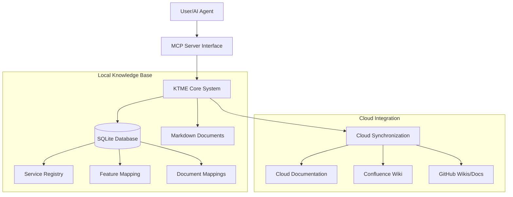

# KTME - Knowledge Tracking & Management Engine

KTME is a powerful tool for tracking, managing, and generating documentation from code changes. It provides seamless integration with Git repositories and offers both file-based and SQLite-based storage options.

## Features

- **Git Integration**: Automatically extracts and tracks code changes from Git repositories
- **Multiple Storage Backends**: Supports both TOML file-based storage and SQLite database
- **Documentation Generation**: Generates comprehensive documentation from code changes
- **MCP Server Integration**: Provides Model Context Protocol server capabilities
- **Service Mapping**: Maps different services to their documentation locations

## Recent Changes

### AI Agent Knowledge Management (Latest)

KTME now provides comprehensive support for AI agents with advanced knowledge tree mapping and document synchronization capabilities.

#### New Features
- **Intelligent Service Detection**: Automatic detection of service names from Git repositories
- **Mock AI Provider**: Built-in documentation generation without requiring API keys
- **Advanced Search**: Feature and keyword-based search with relevance scoring
- **MCP Server Integration**: Enhanced Model Context Protocol server with AI agent tools

#### Documentation Generation
```bash
# Generate documentation from staged changes
ktme generate --service ktme --staged --type api-doc

# Generate changelog
ktme generate --service ktme --staged --type changelog

# Output to file
ktme generate --service ktme --staged --output docs/my-docs.md
```

### SQLite Database Support

The project has been enhanced with SQLite database support for improved performance and scalability:

#### Configuration Changes
- Added `use_sqlite` flag in configuration to enable/disable SQLite storage
- Added `database_file` option to specify custom database file location
- Default database location: `~/.config/ktme/ktme.db`

#### Database Schema
The SQLite database includes the following tables:
- `services`: Stores service definitions
- `document_mappings`: Maps documents to their storage locations
- `provider_configs`: Configuration for different documentation providers
- `prompt_templates`: Templates for generating documentation
- `document_templates`: Document structure templates
- `generation_history`: Track documentation generation history
- `diff_cache`: Cache for storing Git diff information
- `schema_versions`: Database schema version tracking

#### Storage Manager Updates
The `StorageManager` now supports:
- Dual storage mode (TOML + SQLite)
- Database initialization and migration
- Service listing from database
- Database statistics retrieval

## Upcoming Features

### 🚧 Advanced Knowledge Management (Planned)

#### Feature Mapping System
- **Feature Relationships**: Track parent-child relationships and dependencies between features
- **Relevance Scoring**: Intelligent scoring of feature-document relationships
- **Cross-Service Mapping**: Discover relationships between features across different services
- **Automated Extraction**: Automatically extract features from code and documentation

#### AI Agent Integration
- **Knowledge Tree**: Hierarchical organization of services, features, and documentation
- **Context-Aware Search**: Understand user intent and provide relevant results
- **Semantic Search**: Vector-based search for finding related content
- **Multi-Modal Support**: Search across code, documentation, and examples

#### Cloud Synchronization
- **Multi-Provider Support**: Sync with Confluence, GitHub, Notion, and S3
- **Bi-Directional Sync**: Two-way synchronization with conflict resolution
- **Version Tracking**: Keep track of document versions and changes
- **Offline Support**: Work offline and sync when connected

#### Enhanced MCP Tools
```bash
# Advanced feature search with context
ktme_search_features --query "user authentication" --context "security"

# Knowledge tree mapping
ktme_map_knowledge --service "auth-service" --depth 3

# Cloud synchronization
ktme_sync_documents --provider confluence --workspace "team-docs"

# Context-aware queries for AI agents
ktme_query_context --service "payment" --features "fraud,detection"
```

#### Performance & Scalability
- **Caching Layer**: Intelligent caching of search results and documents
- **Incremental Sync**: Only sync changed documents to reduce bandwidth
- **Background Processing**: Handle large repositories efficiently
- **Rate Limiting**: Respect API limits for cloud providers

### 🎯 AI Agent Knowledge Management Architecture

KTME provides a comprehensive knowledge management system for AI agents:



See [docs/architecture.md](docs/architecture.md) for detailed architecture diagrams and implementation plans.

## Installation

```bash
# Install via npm
npm install -g ktme-cli

# Or build from source
cargo build --release
```

## Configuration

Create a configuration file at `~/.config/ktme/config.toml`:

```toml
[storage]
use_sqlite = true
database_file = "~/.config/ktme/ktme.db"
mappings_file = "~/.config/ktme/mappings.toml"
auto_discover = false
```

## Usage

### Basic Commands

```bash
# List all services
ktme list-services

# Add a new service mapping
ktme mapping add <service-name> <documentation-path>

# Generate documentation
ktme generate <service-name>

# Read changes from Git
ktme read-changes --source HEAD
```

### MCP Server

KTME provides an MCP server for integration with various tools:

```bash
# Start the MCP server
ktme mcp server

# Available MCP tools:
# - ktme_read_changes: Extract Git changes
# - ktme_list_services: List all services
# - ktme_get_service_mapping: Get documentation location for a service
# - ktme_generate_documentation: Generate documentation from changes
# - ktme_update_documentation: Update existing documentation
```

## Database Verification

To verify SQLite database is working correctly:

```bash
# Check database exists
ls -la ~/.config/ktme/ktme.db

# Query database directly
sqlite3 ~/.config/ktme/ktme.db ".tables"

# Check service count
sqlite3 ~/.config/ktme/ktme.db "SELECT COUNT(*) FROM services;"
```

## Architecture

```
┌─────────────────┐    ┌──────────────────┐    ┌─────────────────┐
│   Git Repository│───▶│   Change Reader  │───▶│  Documentation  │
└─────────────────┘    └──────────────────┘    │    Generator    │
                              │                └─────────────────┘
                              ▼                          │
┌─────────────────┐    ┌──────────────────┐             ▼
│  Storage Layer  │◀───│  Storage Manager │◀───┌─────────────────┐
│  (TOML/SQLite)  │    └──────────────────┘    │   MCP Server    │
└─────────────────┘                             └─────────────────┘
```

## Development

### Project Structure

- `src/config/`: Configuration management
- `src/storage/`: Storage abstraction and implementations
- `src/git/`: Git integration and change extraction
- `src/mcp/`: MCP server implementation
- `src/cli/`: Command-line interface

### Building from Source

```bash
# Clone the repository
git clone https://github.com/your-org/ktme.git
cd ktme

# Build
cargo build --release

# Run tests
cargo test
```

## Contributing

1. Fork the repository
2. Create a feature branch
3. Make your changes
4. Add tests
5. Submit a pull request

## License

This project is licensed under the MIT License.