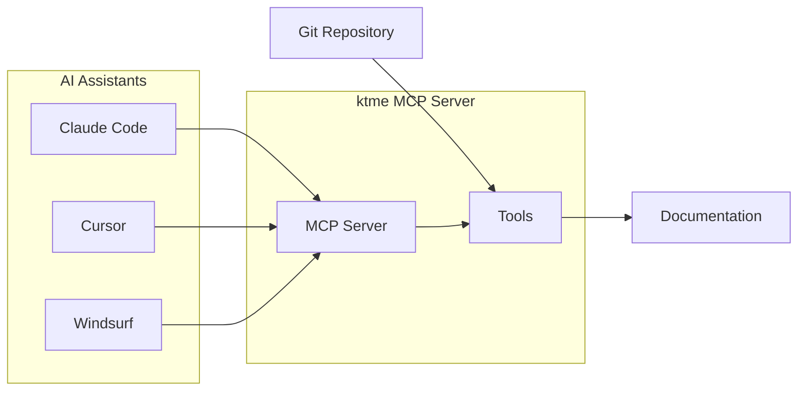
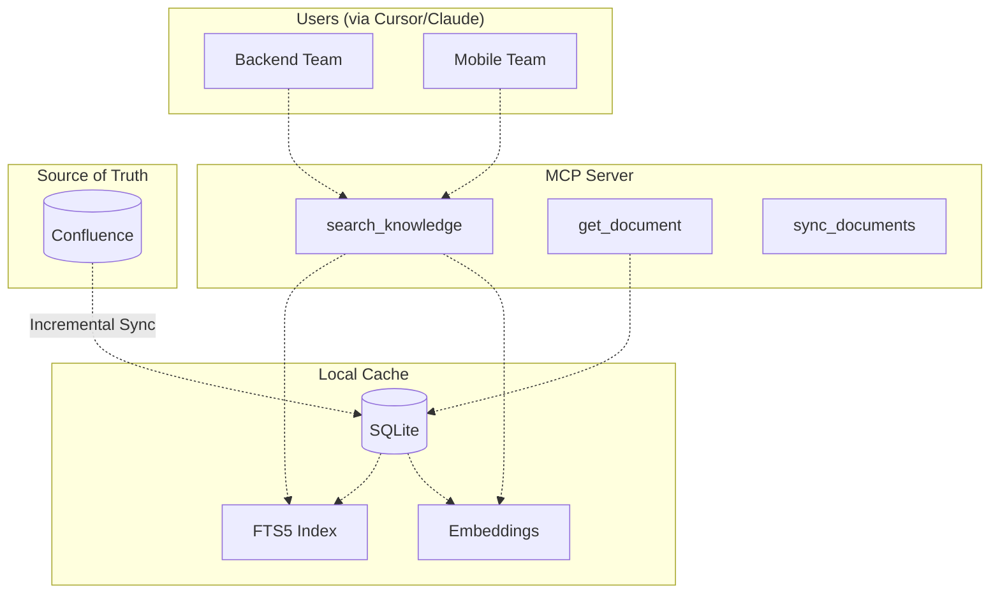
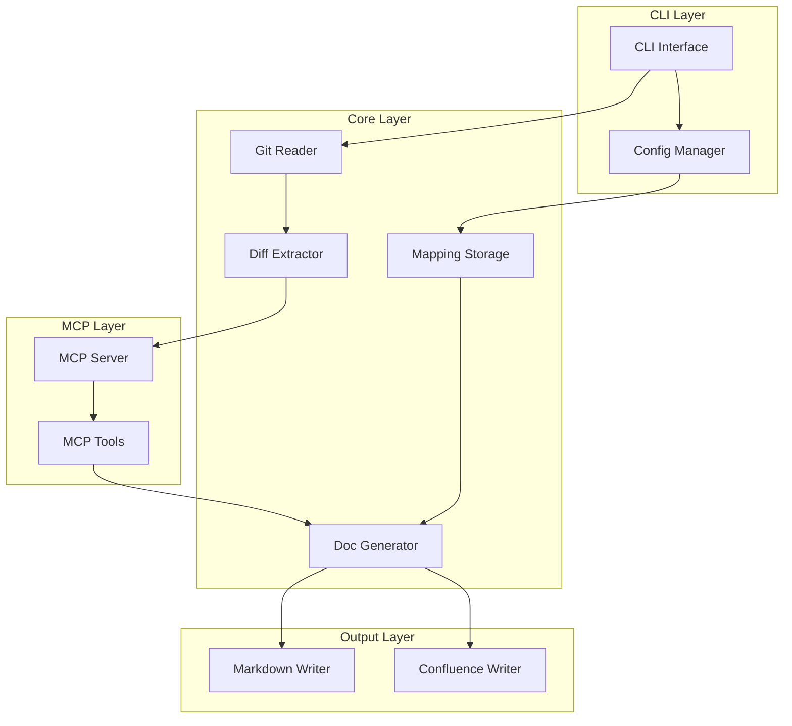

# ktme - Knowledge Transfer Me

[](LICENSE)
[](https://www.rust-lang.org/)
[](https://modelcontextprotocol.io/)

A Rust-based CLI tool and MCP server for automated documentation generation from code changes. Integrates with AI coding assistants like **Claude Code**, **Cursor**, **Windsurf**, and other MCP-compatible clients.

## Table of Contents

- [Overview](#overview)
- [Core Concepts](#core-concepts)
- [Features](#features)
- [Installation](#installation)
- [AI Agent Integration](#ai-agent-integration)
- [Quick Start](#quick-start)
- [Configuration](#configuration)
- [MCP Tools](#mcp-tools)
- [Knowledge Search (RAG)](#knowledge-search-rag)
- [Usage Examples](#usage-examples)
- [Architecture](#architecture)
- [Contributing](#contributing)
- [License](#license)

## Overview

**ktme** (Knowledge Transfer Me) is a CLI tool and MCP server that bridges code changes with documentation. It uses the [Model Context Protocol (MCP)](https://modelcontextprotocol.io/) to communicate with AI coding assistants, enabling them to:

- Read and analyze code changes from Git
- Generate documentation based on diffs
- Update existing docs intelligently
- Publish to Markdown files or Confluence



### How It Works

1. **You configure** ktme as an MCP server in your AI assistant (Claude Code, Cursor, etc.)
2. **AI assistant connects** to ktme via the Model Context Protocol
3. **AI uses ktme tools** to read code changes, query mappings, and generate docs
4. **Documentation is created** in your preferred format (Markdown, Confluence)

## Core Concepts

### Multi-Source Change Extraction

ktme can extract code changes from multiple sources:

```bash
# From commits
ktme extract --commit abc123

# From staged changes
ktme extract --staged

# From pull requests
ktme extract --pr 456 --provider github

# From commit ranges
ktme extract --commit v1.0.0..v1.1.0
```

### Service-to-Documentation Mapping

Map your services to their documentation locations:

```toml
# ~/.config/ktme/mappings.toml
[[services]]
name = "api-gateway"
path = "my-company/api-gateway"
docs = [
  { type = "markdown", location = "my-company/api-gateway/README.md" },
  { type = "confluence", location = "https://confluence.example.com/display/DEV/APIGateway" }
]
```

### MCP Integration

ktme exposes tools through the Model Context Protocol, enabling AI assistants to:

- Read extracted code changes
- Query service-document mappings
- Generate documentation based on changes
- Update existing documentation intelligently

## Features

| Feature | Status | Description |
|---------|--------|-------------|
| CLI Interface | ✅ **IMPLEMENTED** | Complete command structure with extract, generate, mapping, MCP, and config commands |
| Git Diff Extraction | ✅ **IMPLEMENTED** | Extract from commits and staged changes (PR extraction not yet implemented) |
| AI-Powered Generation | ✅ **IMPLEMENTED** | Generate documentation using OpenAI or Claude AI models |
| Service Mapping Storage | ✅ **IMPLEMENTED** | SQLite database for storing service-to-documentation mappings |
| MCP Server with Tools | ✅ **IMPLEMENTED** | Functional MCP server with tools for reading changes, mappings, and generating docs |
| Configuration Management | ✅ **IMPLEMENTED** | TOML-based configuration with environment variable support |
| Database Layer | ✅ **IMPLEMENTED** | Complete SQLite models and repositories for all features |
| JSON Output Format | ✅ **IMPLEMENTED** | Export diffs and data in JSON format |
| Basic Error Handling | ✅ **IMPLEMENTED** | Comprehensive error types and propagation |
| Git Platform Support | 🔄 **PARTIAL** | Local Git ✅, GitHub/GitLab PR support framework exists |
| Template System | 🔄 **FRAMEWORK** | Template structure in place, basic rendering implemented |
| Documentation Providers | 🔄 **BASIC** | Markdown file writer ✅, Confluence provider structure exists |
| PR Extraction | ❌ **NOT IMPLEMENTED** | GitHub/GitLab API integration for PR diffs |
| Knowledge Search/RAG | ❌ **NOT IMPLEMENTED** | Vector embeddings and semantic search features |
| Confluence Sync | ❌ **NOT IMPLEMENTED** | No Confluence API integration implemented |
| Feature Mapping System | ❌ **NOT IMPLEMENTED** | Feature-to-document mapping not implemented |

## Current Implementation Status

### ✅ **Fully Implemented**
- **CLI Interface**: Complete command-line interface with all major commands (extract, generate, mapping, MCP, config)
- **Git Operations**: Functional diff extraction from commits and staged changes using git2-rs
- **AI Integration**: Working OpenAI and Claude API clients with automatic provider detection
- **MCP Server**: Fully functional MCP server with STDIO transport and working tools
- **SQLite Storage**: Complete database layer with models and repositories
- **Service Mapping**: Add, list, get, remove service-to-document mappings
- **Configuration**: TOML-based configuration management with environment variables
- **Error Handling**: Comprehensive error types and proper propagation

### 🔄 **Partially Implemented**
- **Documentation Generation**: Basic template-based generation from Git diffs
- **Markdown Writer**: Simple file-based documentation output
- **PR Extraction**: Framework exists but GitHub/GitLab API integration not implemented
- **Confluence Provider**: Structure in place but API calls not implemented
- **Template System**: Basic template structure exists
- **HTTP Transport**: SSE mode structure implemented but not tested

### ❌ **Not Yet Implemented**
- **Knowledge Search/RAG**: No vector embeddings, semantic search, or RAG functionality
- **Confluence Sync**: No incremental sync or API integration
- **Feature Mapping**: No feature-to-document mapping system
- **Bitbucket Integration**: Provider structure not implemented
- **Advanced Templates**: No sophisticated template rendering
- **Web UI**: No web interface for managing mappings

### ⚠️ **Known Issues**
- 103 compilation warnings (mostly unused code - expected for incomplete features)
- PR extraction returns error - GitHub/GitLab API not implemented
- Some MCP tools have basic implementations (generate_documentation creates simple markdown)
- Confluence provider structure exists but API calls not implemented

## Installation

### Prerequisites

- Rust 1.70 or higher
- Git 2.30 or higher
- Access to an AI model API (Claude, GPT, etc.)

### From Source

```bash
git clone https://github.com/FreePeak/ktme.git
cd ktme
cargo build --release
```

### Using Cargo

```bash
cargo install --path .
```

### Development Workflow

For active development, use one of these methods to update your ktme command after code changes:

**Method 1: Makefile (Recommended)**
```bash
# Quick development cycle
make dev

# Or step by step
make build-release
make install-dev
```

**Method 2: Rebuild and Replace**
```bash
# After code changes, rebuild
cargo build --release

# Copy to system location (one-time setup)
sudo cp ./target/release/ktme /usr/local/bin/ktme
```

**Method 3: Cargo Install (Easiest)**
```bash
# After code changes, reinstall globally
cargo install --path --force .
```

**Method 4: Development Alias**
Add to your `~/.zshrc` or `~/.bashrc`:
```bash
alias ktme="cd /path/to/ktme && ./target/release/ktme"
```

**Method 5: PATH Update**
Add to your shell config:
```bash
export PATH="/path/to/ktme/target/release:$PATH"
```

### Using Makefile

The project includes a Makefile for common development tasks:

```bash
# Show all available targets
make help

# Build and install in development mode
make dev

# Build in release mode
make build-release

# Run tests and formatting
make ci

# MCP server management
make run-mcp    # Start server
make stop-mcp   # Stop server
make status-mcp # Check status
```

### Verify Installation

```bash
ktme --version
```

## AI Agent Integration

ktme uses the [Rust MCP SDK](https://github.com/modelcontextprotocol/rust-sdk) to implement the Model Context Protocol, enabling seamless communication with AI coding assistants.

### Claude Code

Add to your Claude Code MCP settings (`~/.claude/mcp_settings.json`):

```json
{
  "mcpServers": {
    "ktme": {
      "command": "ktme",
      "args": ["mcp", "start"],
      "env": {
        "KTME_MCP_API_KEY": "your-api-key"
      }
    }
  }
}
```

### Cursor

Add to Cursor's MCP configuration (`.cursor/mcp.json`):

```json
{
  "servers": {
    "ktme": {
      "command": "ktme",
      "args": ["mcp", "start", "--stdio"]
    }
  }
}
```

### Windsurf

Add to Windsurf's MCP settings:

```json
{
  "mcp": {
    "servers": {
      "ktme": {
        "command": "ktme",
        "args": ["mcp", "start", "--stdio"]
      }
    }
  }
}
```

### SSE Mode (HTTP)

For HTTP-based connections, start ktme in SSE mode:

```bash
ktme mcp start --sse --host 127.0.0.1 --port 8080
```

Then configure your AI assistant to connect to `http://127.0.0.1:8080`.

## Quick Start

### 1. Initialize Configuration

```bash
ktme config init
```

### 2. Set Up API Key

```bash
export KTME_MCP_API_KEY="your-api-key"
```

### 3. Map Your Service

```bash
ktme mapping add my-service --file ~/projects/my-service/README.md
```

### 4. Generate Documentation

```bash
cd ~/projects/my-service
ktme generate --commit HEAD --service my-service
```

## Configuration

### Configuration File

Location: `~/.config/ktme/config.toml`

```toml
[general]
default_directory = "~/work/my-company"
log_level = "info"

[git]
default_branch = "main"
include_merge_commits = false

[mcp]
model = "claude-3-5-sonnet-20241022"
max_tokens = 4096
temperature = 0.7

[documentation]
default_format = "markdown"
template_directory = "~/.config/ktme/templates"

[confluence]
base_url = "https://your-domain.atlassian.net"
auth_type = "token"
space_key = "DEV"
```

### Environment Variables

| Variable | Description |
|----------|-------------|
| `KTME_MCP_API_KEY` | AI model API key |
| `KTME_MCP_MODEL` | Model identifier |
| `CONFLUENCE_API_TOKEN` | Confluence authentication token |
| `CONFLUENCE_USERNAME` | Confluence username |
| `KTME_LOG_LEVEL` | Logging level (debug, info, warn, error) |
| `OPENAI_API_KEY` | OpenAI API key for embeddings (optional) |

### Knowledge Search Configuration

```toml
[knowledge]
# Cache location (default: ~/.config/ktme/knowledge.db)
cache_path = "~/.config/ktme/knowledge.db"

# Embedding provider: "openai" or "local"
embedding_provider = "local"

# Confluence spaces to sync
sync_spaces = ["MOBILE", "BACKEND", "SHARED"]

# Auto-sync interval in hours (0 = manual only)
auto_sync_interval = 0

[knowledge.chunking]
# Chunk size for RAG (tokens)
chunk_size = 512
chunk_overlap = 50
```

## MCP Tools

ktme exposes the following tools through MCP:

### Documentation Tools

| Tool | Description |
|------|-------------|
| `read_changes` | Read extracted diff from a file or Git |
| `generate_documentation` | Create new documentation from changes |
| `update_documentation` | Modify existing documentation |

### Mapping Tools

| Tool | Description |
|------|-------------|
| `get_service_mapping` | Retrieve document URL for a service |
| `list_services` | List all mapped services |
| `add_mapping` | Add a new service-to-doc mapping |

### Git Tools

| Tool | Description |
|------|-------------|
| `extract_commit` | Extract changes from a specific commit |
| `extract_pr` | Extract changes from a pull request |
| `list_commits` | List commits in a range |

### Knowledge Search Tools

| Tool | Description |
|------|-------------|
| `search_knowledge` | Search documentation using natural language queries |
| `get_document` | Retrieve full document content by ID or URL |
| `list_documents` | List documents filtered by team, tags, or source |
| `sync_documents` | Trigger sync from Confluence or other sources |

### Feature Mapping Tools

| Tool | Description |
|------|-------------|
| `get_feature` | Get a feature/screen with all related documentation |
| `map_feature_document` | Link a feature to a documentation page |
| `list_features` | List all features filtered by team |

## Knowledge Search (RAG) - NOT IMPLEMENTED

> **⚠️ WARNING**: This section describes planned features that are not yet implemented. The knowledge search, RAG capabilities, and related tools do not exist in the current codebase.

ktme is designed to include a powerful knowledge search system that will enable teams to search documentation across Confluence and local files using natural language queries through MCP-connected AI assistants.

### Planned Architecture



### How It Will Work

1. **Confluence is the source of truth** - All documentation lives in Confluence
2. **Local SQLite cache** - Documents will be synced to a local cache for fast searching
3. **Hybrid search** - Will combine keyword matching (FTS5) with semantic search (embeddings)
4. **Incremental sync** - Will only fetch documents modified since last sync

### Planned Knowledge Search Tools

| Tool | Status | Description |
|------|--------|-------------|
| `search_knowledge` | ❌ Not Implemented | Search documentation using natural language |
| `get_document` | ❌ Not Implemented | Retrieve full document content by ID |
| `list_documents` | ❌ Not Implemented | List documents by team, tags, or source |
| `sync_documents` | ❌ Not Implemented | Sync documents from Confluence |

### Syncing Documents

```bash
# Initial full sync from Confluence
ktme sync --space MOBILE --full
ktme sync --space BACKEND --full

# Incremental sync (only changed documents)
ktme sync --space MOBILE

# Sync all configured spaces
ktme sync --all
```

### Searching Knowledge

```bash
# CLI search
ktme search "food home list resto"
ktme search "payment integration" --team mobile
ktme search "authentication flow" --tag "feature:auth"

# Via MCP (AI assistant uses these tools)
# search_knowledge("food home list resto")
# search_knowledge("how does the order API work", team="backend")
```

### Tagging Documents

Documents can be tagged for better organization:

```bash
# Add tags to indexed documents
ktme tag DOC_ID --team mobile --tag "screen:food_home"
ktme tag DOC_ID --tag "feature:restaurant_list"

# Search by tags
ktme search --tag "screen:*" --team mobile
```

### Cache Location

The knowledge cache is stored locally per user:

```
~/.config/ktme/
  config.toml           # Configuration
  ktme.db               # Service mappings
  knowledge.db          # Knowledge search cache
    documents           # Cached document content
    documents_fts       # Full-text search index
    document_chunks     # RAG chunks for context
    embeddings          # Vector embeddings
    sync_state          # Last sync timestamps
```

The cache is ephemeral and can be regenerated by re-syncing from Confluence.

### Feature Mapping - NOT IMPLEMENTED

> **⚠️ WARNING**: This section describes planned features that are not yet implemented. The feature mapping system does not exist in the current codebase.

Features are planned to represent logical units like mobile screens, components, or business flows. They will be mapped to documentation and services.

**Planned Commands:**

```bash
# Add a feature (mobile screen)
ktme feature add food_home_screen \
    --team mobile \
    --display-name "Food Home Screen" \
    --aliases "food home,resto list,home screen"

# Map feature to documentation
ktme feature map food_home_screen \
    --doc-url "https://confluence.company.com/display/MOBILE/Food+Home"

# Link feature to backend service
ktme feature link food_home_screen --service restaurant-api

# Get feature with all related docs
ktme feature get food_home_screen
```

**Planned Feature-Service-Document Relationships:**

```
Feature (Mobile)          Service (Backend)       Document (Confluence)
----------------          -----------------       ---------------------
food_home_screen    <---> restaurant-api    ---> "Food Home Design Doc"
                    <---> order-api         ---> "Restaurant API Reference"
                                            ---> "Order Flow Doc"
```

### Example: Mobile Team Searching Documentation

```
Mobile Dev in Cursor: "Find docs about the food home list resto screen"

AI Assistant calls: search_knowledge("food home list resto screen")

System searches:
1. Features FTS: Matches "food_home_screen" via alias "food home"
2. Documents FTS: Matches documents containing "resto list"
3. Returns merged results with feature->document mappings

Results returned:
1. "Food Home Screen - Restaurant List"
   URL: https://confluence.company.com/display/MOBILE/Food+Home
   Team: mobile
   Feature: food_home_screen
   Related Services: [restaurant-api, order-api]
   Summary: "The food home screen displays a list of nearby restaurants..."

2. "Restaurant API Integration"
   URL: https://confluence.company.com/display/BACKEND/Restaurant+API
   Team: backend
   Service: restaurant-api
   Related Features: [food_home_screen, resto_list]
   Summary: "API endpoints for fetching restaurant data..."
```

## Usage Examples

> **⚠️ NOTE**: The examples below show the intended usage, but most CLI commands are not yet implemented. The project compiles but command handlers are missing.

### Document a Feature Branch (Planned)

```bash
# Extract changes from feature branch
ktme extract --commit main..feature/new-api --output /tmp/feature.json

# Generate documentation
ktme generate --input /tmp/feature.json --service api-gateway --type api-doc
```

### Update Changelog from PR (Planned)

```bash
# Extract PR changes
ktme extract --pr 456 --provider github

# Update changelog section
ktme update --pr 456 --service user-service --section "Changelog"
```

### Publish to Confluence (Planned)

```bash
# Configure Confluence
export CONFLUENCE_API_TOKEN="your-token"
ktme config set confluence.base_url "https://company.atlassian.net"

# Map and generate
ktme mapping add auth-service --url "https://company.atlassian.net/wiki/spaces/DEV/pages/12345"
ktme generate --commit abc123 --service auth-service --format confluence
```

### Document Staged Changes (Planned)

```bash
# Stage your changes
git add src/main.rs

# Generate documentation before committing
ktme generate --staged --service my-service

# Commit both code and docs
git add .
git commit -m "feat: Add new feature with documentation"
```

### What Actually Works Now

```bash
# Build the project
cargo build --release

# Extract changes from staging
./target/release/ktme extract --staged --output changes.json

# Extract changes from a commit
./target/release/ktme extract --commit HEAD --output last-commit.json

# Start MCP server with STDIO transport
./target/release/ktme mcp start --stdio

# Check version
./target/release/ktme --version

# The binary compiles and runs with working Git operations
```

## Architecture



### Component Overview

| Component | Purpose |
|-----------|---------|
| CLI Interface | Command parsing and user interaction |
| Git Reader | Extract changes from Git repositories |
| Diff Extractor | Parse and structure Git diffs |
| MCP Server | Model Context Protocol communication |
| Doc Generator | Transform AI output to documentation |
| Mapping Storage | Service-to-document mappings |
| Writers | Output to Markdown or Confluence |

## Supported Platforms

| Platform | PR Extraction | Commit Extraction |
|----------|---------------|-------------------|
| GitHub | Yes | Yes |
| GitLab | Yes | Yes |
| Bitbucket | Yes | Yes |
| Local Git | N/A | Yes |

## Troubleshooting

### Common Issues

**MCP server connection failed**
```bash
ktme mcp status
ktme mcp start
```

**Service mapping not found**
```bash
ktme mapping list
ktme mapping add my-service --file ~/path/to/docs/README.md
```

**Enable debug logging**
```bash
export KTME_LOG_LEVEL="debug"
ktme --verbose generate --commit abc123 --service my-service
```

## Implementation Analysis & Roadmap

### Codebase Architecture

ktme follows a well-structured architecture with clear separation of concerns:

- **`src/main.rs`**: Entry point with CLI command definitions
- **`src/cli/`**: Command-line interface and command handlers
- **`src/mcp/`**: MCP server implementation with tools
- **`src/git/`**: Git operations and diff extraction
- **`src/ai/`**: AI provider integrations (OpenAI, Claude)
- **`src/storage/`**: SQLite database models and repositories
- **`src/config/`**: Configuration management
- **`src/doc/`**: Documentation providers and writers
- **`src/error.rs`**: Comprehensive error handling

### Current Build Status

- ✅ Project compiles successfully with `cargo build --release`
- ⚠️ 103 warnings (mostly unused code from incomplete features)
- ✅ All dependencies properly configured
- ✅ Binary runs and responds to commands
- ✅ Git operations work correctly
- ✅ MCP server starts in STDIO mode

### Implementation Priorities

#### Phase 1: Complete Core Features (1-2 weeks)
1. **PR Extraction Implementation**
   - Add GitHub API client for PR diffs
   - Implement GitLab API integration
   - Test with real pull requests

2. **Enhance Documentation Generation**
   - Improve AI prompt templates
   - Add better diff-to-documentation logic
   - Support multiple documentation formats

3. **Complete MCP Tools**
   - Enhance generate_documentation with AI integration
   - Add error handling for all tools
   - Test with Claude Code/Cursor integration

#### Phase 2: Provider Integration (2-3 weeks)
1. **Confluence Provider**
   - Implement REST API client
   - Add authentication (token/oauth)
   - Create and update pages

2. **Template System**
   - Implement variable substitution
   - Add built-in templates
   - Support custom templates

3. **Configuration Commands**
   - Complete config command implementations
   - Add interactive setup
   - Validate configurations

#### Phase 3: Advanced Features (4-6 weeks)
1. **Knowledge Search & RAG**
   - SQLite document caching
   - FTS5 full-text search
   - Vector embeddings for semantic search

2. **Feature Mapping System**
   - Feature-to-service mapping
   - Feature-to-document linking
   - Team-based organization

3. **Confluence Sync**
   - Incremental sync from Confluence
   - Bi-directional updates
   - Conflict resolution

### Testing Strategy

The project currently lacks unit tests. Recommended testing approach:

1. **Unit Tests**: Test individual components (Git reader, AI client, storage)
2. **Integration Tests**: Test CLI commands end-to-end
3. **MCP Tests**: Test MCP server with actual AI assistants
4. **E2E Tests**: Full workflow from Git diff to documentation

### Development Guidelines

1. **Keep It Simple**: Avoid over-engineering, use straightforward solutions
2. **Incremental Development**: Build and test one feature at a time
3. **Error Handling**: Provide clear error messages for debugging
4. **Documentation**: Add inline docs for complex logic
5. **Performance**: Profile before optimizing, focus on actual bottlenecks

## Contributing

Contributions are welcome!

1. Fork the repository
2. Create a feature branch (`git checkout -b feature/amazing-feature`)
3. Commit your changes (`git commit -m 'Add amazing feature'`)
4. Push to the branch (`git push origin feature/amazing-feature`)
5. Open a Pull Request

### Development

```bash
# Build
cargo build

# Build in release mode (recommended for testing)
cargo build --release

# Run tests
cargo test

# Format code
cargo fmt

# Lint
cargo clippy

# Quick development cycle
cargo build --release && ./target/release/ktme --version
```

## License

This project is licensed under the MIT License - see the [LICENSE](LICENSE) file for details.

## Acknowledgments

- [Model Context Protocol](https://modelcontextprotocol.io/) for the MCP specification
- [Rust MCP SDK](https://github.com/modelcontextprotocol/rust-sdk) for MCP server implementation
- [git2-rs](https://github.com/rust-lang/git2-rs) for Git integration
- [clap](https://github.com/clap-rs/clap) for CLI parsing

---

**Built with Rust. Powered by AI. Documentation made simple.**
